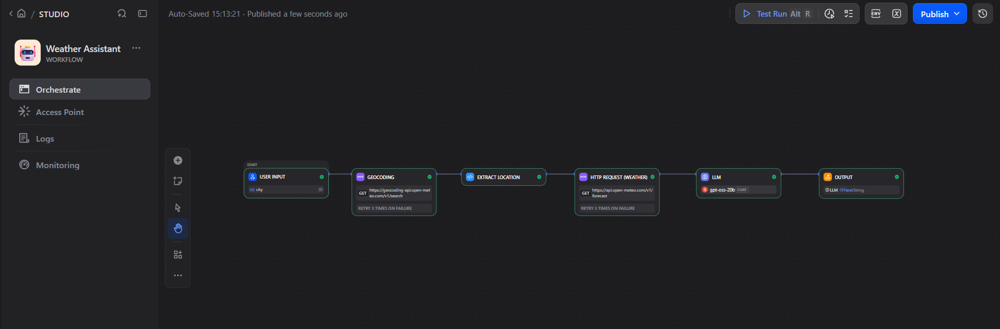
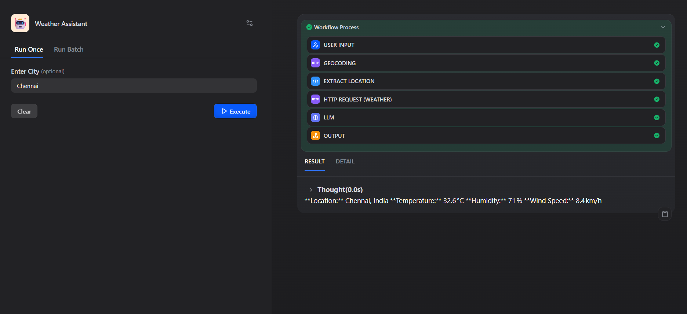
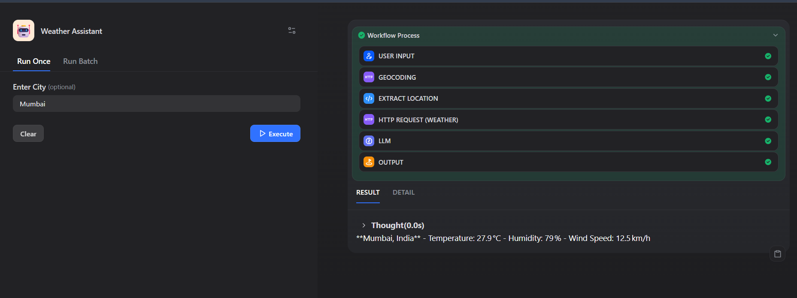

# Weather-Assistant
A GenAI Weather Assistant built using Dify, Open-Meteo APIs, Python, and an LLM.

# 🌦️ Weather Assistant

## 🚀 Live Demo

👉 **[Try the Weather Assistant](https://udify.app/workflow/KrKezablygnJlt9j)**

A GenAI-powered weather assistant built using Dify, Open-Meteo APIs, Python, and an LLM.

## 📌 Project Overview

Weather Assistant is a Dify-based GenAI workflow that allows users to enter a city name and receive current weather information in a simple and readable format.

## 🎯 Objective

The objective of this project is to build a dynamic weather assistant that can:

- Accept a city name from the user
- Find the city's geographical coordinates
- Retrieve current weather information
- Process the weather data
- Generate a simple weather response using an LLM

## 🛠️ Tools & Technologies

- Dify
- Python
- Open-Meteo Geocoding API
- Open-Meteo Weather API
- LLM
- HTTP Request
- JSON

## 🔄 Workflow

```text
User Input
     ↓
Geocoding API
     ↓
Extract Location
     ↓
Weather API
     ↓
LLM
     ↓
Weather Response
 ```
## 📸 Screenshots

### Weather Assistant Workflow


### Chennai Weather


### Mumbai Weather

